```mermaid +render +width:100%
sequenceDiagram
  actor Author
  participant GitHub
  actor Reviewer
  activate Author
  note left of Author: ✍️ Write (A)
  Author ->> GitHub: post PR (A)
  deactivate Author
  GitHub ->> Reviewer: request review
  activate Reviewer
  note over Author: ⏳⏳⏳
  Reviewer ->> GitHub: 💬 feedback
  deactivate Reviewer
  GitHub ->> Author: read feedback
  activate Author
  note left of Author: ✍️ Address feedback
  Author ->> GitHub: push commits (A)
  deactivate Author
  GitHub ->> Reviewer: request review
  activate Reviewer
  note over Author: ⏳⏳⏳
  Reviewer ->> GitHub: ✅ feedback
  deactivate Reviewer
  GitHub ->> GitHub: merge
  GitHub ->> Author: pull
  activate Author
  note left of Author: ✍️ Write (B)
  Author ->> GitHub: post PR (B)
  deactivate Author
  GitHub ->> Reviewer: request review...
```

```mermaid +render +width:100%
sequenceDiagram
  actor Author
  participant GitHub
  actor ReviewerA
  actor ReviewerB
  activate Author
  note left of Author: ✍️ Write (A)
  Author ->> GitHub: post PR (A)
  deactivate Author
  GitHub ->> ReviewerA: request review (A)
  activate ReviewerA
  note left of Author: 🎉 no wait!
  activate Author
  note left of Author: ✍️ Write (B)
  Author ->> GitHub: post PR (B)
  deactivate Author
  GitHub ->> ReviewerB: request review (B)
  activate ReviewerB
  ReviewerB ->> GitHub: ✅ approve (B)
  deactivate ReviewerB
  ReviewerA ->> GitHub: ✅ approve (A)
  deactivate ReviewerA
  GitHub ->> GitHub: merge (A)
  GitHub ->> Author: pull (A)
  Author ->> Author: rebase (B)
  Author ->> GitHub: force-push (B)
  GitHub ->> GitHub: merge (B)
  GitHub ->> Author: pull (B)
```

What is PR Stacking?
====================

<!-- column_layout: [1, 1] -->

<!-- column: 1 -->


<!-- column: 0 -->

# The Big Idea:

Chained PRs,

<!-- pause -->

but reviewed in parallel:

<!-- pause -->

Don't get blocked waiting for reviews!

--------------------------------------------------------------------------------

Without Stacking
================

```sh
# Create a branch
$ git branch ${USER}/my-feat
```

```sh
# Make changes and commit
$ echo "more code" >> README.md
$ git add -A && git commit -m 'docs(readme): more'
```

```sh
# Upload to GitHub and open a PR
$ git push
$ gh pr view --web
```

⏳⏳⏳

--------------------------------------------------------------------------------

# Without Stacking


--------------------------------------------------------------------------------

# Without Stacking



--------------------------------------------------------------------------------

Without Stacking
================

# What to do while waiting for review?

- Work on something unrelated?
- Work on next step locally?

<!-- pause -->

# Anti-Incentives

- 🤔 Context switching = reduced effectiveness
- 😱 Local branch will have to be updated via `merge` or `rebase`
  - Frequent source of git mistakes
- 🐘 Desire to get all changes reviewed at once encourages BIG PRs
  - Harder to read
  - More code owners pinged
  - Easier for mistakes to slip through

--------------------------------------------------------------------------------

<!-- jump_to_middle -->

# With Stacking

--------------------------------------------------------------------------------

With Stacking
=============

- Reviewer (B) can start reviewing / can approve even before (A) is reviewed.
- If (A) needs updates, changes are percolated through to (B), (C) and so on.
- The author merges PRs in order, as they become approved.
- Author can keep writing code continuously!


--------------------------------------------------------------------------------

# With Stacking


--------------------------------------------------------------------------------

# With Stacking




--------------------------------------------------------------------------------

Examples
========

# UI -> DRUIDS -> More UI

<!-- column_layout: [1, 1] -->

<!-- column: 0 -->


<!-- column: 1 -->


<!-- reset_layout -->

1. First PR: `ccm-frontend` reviewed adding badge to header
1. Second PR: `designops` reviewed a new param for `VerticalNavItem`
1. Third PR: `ccm-frontend` reviewed adding badge to `VerticalNavItem`

--------------------------------------------------------------------------------

Examples
========

# Migrate -> Migrate -> Migrate

<!-- column_layout: [1, 1] -->

<!-- column: 0 -->


<!-- column: 1 -->

1. First PR: migrate package A
1. Second PR: migrate package B (independent, but:)
1. Third PR: migrate C which depended on A and B

<!-- reset_layout -->

Each migration touched 20–30 files, but it's a lot easier to review when only
one package is migrated at a time!


--------------------------------------------------------------------------------

Reasons to Stack
================

- Different teams / codeowners might not want to review a small change in the
  middle of your large PR
- Single-purpose PRs are easier to reason about / understand / read / analyze
- Easy & fast code changes which are high priority can be merged now, while
  continuing to work on hard & slow follow-up changes

--------------------------------------------------------------------------------

Manual Stacking Challenges
====================

- Consider a stack of 4+ PRs. It's hard to keep track of all those branches!
- What if someone requests changes to PR #3? You have to do the following:
  1. Check out branch 2, make changes, push PR 2
  1. Check out branch 3, merge from or rebase onto 2, (force-)push PR 3
  1. Check out branch 4, merge from or rebase onto 3, (force-)push PR 4


<!-- pause -->

😱 BUT WAIT THERE'S MORE: what about **merge conflicts!?**

--------------------------------------------------------------------------------

Tooling to the Rescue
=====================

<!-- column_layout: [1, 1] -->

<!-- column: 0 -->

This is a (semi-)solved problem!

- [https://www.stacking.dev/](https://www.stacking.dev/)
- `git machete`
- `ghstack`
- `sapling`
- Many others

<!-- column: 1 -->


--------------------------------------------------------------------------------

Enter Graphite
==============

<!-- column_layout: [1, 1] -->

<!-- column: 0 -->


<!-- column: 1 -->


<!-- reset_layout -->


--------------------------------------------------------------------------------

Enter Graphite
==============

<!-- column_layout: [1, 1] -->

<!-- column: 0 -->


<!-- column: 1 -->

- Based on workflows used within Google, Meta, etc.
- Biased towards 1 commit = 1 branch = 1 PR (but you _can_ do multiple commits
  per branch/PR.)
- Treats stacks as first-class notion
- CLI, web app, and VSCode extension
- Managed service
- Smooths out rough edges of managing stacks

--------------------------------------------------------------------------------

<!-- jump_to_middle -->

# Getting Started

--------------------------------------------------------------------------------

First-Time Initialization
=========================

```zsh +line_numbers
$ cd dd/web-ui
$ gt init
Welcome to Graphite!

✔ Select a trunk branch, which you base branches on - inferred trunk main
(autocomplete or arrow keys) › main
```

Graphite uses a "trunk-based" workflow (think `preprod` in `web-ui`)

--------------------------------------------------------------------------------

First Steps
===========

```zsh +line_numbers
$ gt checkout main # or preprod, whatever your trunk branch is

# Create a branch
$ gt create ${USER}/favorite-things

# Make changes
$ echo "- Rain drops on roses" >> favorite-things.md

# Add a git commit (can also do -cam)
$ gt modify --commit --all --message 'feat(faves): add raindrops'
```

--------------------------------------------------------------------------------

Submitting for Review
=====================

At this point, you might be ready to post a PR for review.

```zsh +line_numbers
$ gt submit
```

OR, you might still be working locally – sometimes we aren't totally sure how
we want to break up our changes until we are farther along.

--------------------------------------------------------------------------------

Chaining a Branch
=================

```zsh +line_numbers
# Create a branch
$ gt create ${USER}/update-docs

# Make changes
$ echo "This is also a repo of my favorite things" >> readme.md

# Add a git commit (can also do -cam)
$ gt modify --commit --all --message 'docs(readme): explain faves'
```

--------------------------------------------------------------------------------

Check the Logs
==============

```zsh +line_numbers +exec
/// cd ~/dev/talks/graphite-talk
gt log
```

Graphite knows about chaining branches in a stack!

--------------------------------------------------------------------------------

Check the Logs
==============

```zsh +line_numbers +exec
/// cd ~/dev/talks/graphite-talk
gt log short
```

--------------------------------------------------------------------------------

Submitting PRs for Review
=========================

```zsh +line_numbers
# Can also do `gt submit --no-edit` for slightly less noise
gt submit
```

Graphite has config options for auto branch prefixes, naming, drafting in CLI
vs. taking you to their web UI, etc.

--------------------------------------------------------------------------------

Addressing Feedback
===================

# GitHub PR: Add favorite things

> Suggestion: add whiskers on kittens!

# Local

```zsh +line_numbers
# Switch back to earlier branch
$ gt checkout gabriel.lebec/favorite-things

# Make updates & commit
$ echo "- Whiskers on kittens" >> favorite-things.md
$ gt modify --all # omitting `-c` means the last commit will be amended
```

But now we need to percolate changes back up the stack:

```zsh +line_numbers
$ gt submit
```

Graphite handles the chain of rebasing and force-pushing for you!

--------------------------------------------------------------------------------

Merge conflicts
===============

(Demo)
